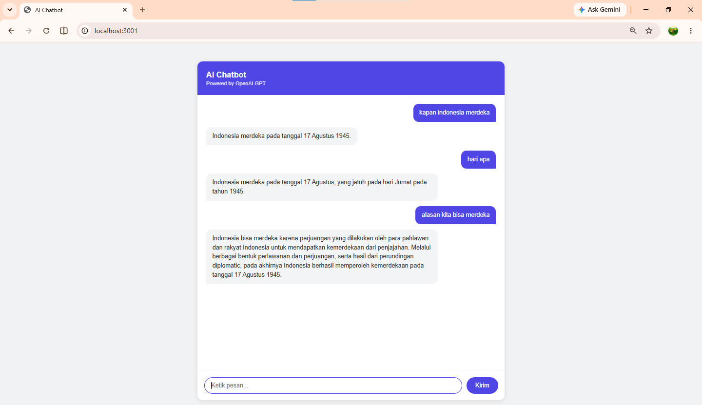

# AI Chatbot

Chatbot sederhana yang terintegrasi dengan OpenAI GPT.
Dibangun dengan Node.js, Express.js, dan EJS.

## Fitur

- ✅ Chat realtime dengan AI
- ✅ Context percakapan (history)
- ✅ Loading state saat AI memproses
- ✅ Error handling
- ✅ API key aman di backend

## Tech Stack

- **Runtime:** Node.js
- **Framework:** Express.js
- **Template Engine:** EJS
- **AI Provider:** OpenAI GPT-3.5 Turbo

## Cara Mendapatkan OpenAI API Key

1. Buka [platform.openai.com](https://platform.openai.com)
2. Register atau Login
3. Klik menu **"API Keys"** di sidebar kiri
4. Klik **"Create new secret key"**
5. Beri nama key (opsional) → klik **"Create"**
6. **Copy key** — simpan baik-baik, tidak bisa dilihat lagi setelah ditutup

### Catatan Penting

> OpenAI API **tidak gratis** — membutuhkan saldo minimal.
>
> Langkah top up:
>
> 1. Buka [platform.openai.com/settings/billing](https://platform.openai.com/settings/billing)
> 2. Klik **"Add payment method"**
> 3. Masukkan kartu kredit/debit
> 4. Top up minimal **$5**
>
> Untuk demo dan testing ringan, $5 lebih dari cukup.

## Cara Menjalankan

### Prasyarat

- Node.js v18 atau lebih baru
- OpenAI API Key

### Langkah Instalasi

1. Clone repository

```bash
git clone https://github.com/username/ai-chatbot.git
cd ai-chatbot
```

2. Install dependencies

```bash
npm install
```

3. Buat file `.env`

```bash
cp .env.example .env
```

4. Isi API key di `.env`
   OPENAI_API_KEY=isi_api_key_anda_disini
   PORT=3001

5. Jalankan aplikasi

```bash
npm run dev
```

6. Buka browser
   http://localhost:3001

## Alur Aplikasi

User ketik pesan di browser

↓

Frontend kirim POST /chat

↓

Backend terima pesan + history

↓

Backend kirim ke OpenAI API

↓

OpenAI kembalikan jawaban

↓

Backend kirim ke frontend

↓

Frontend tampilkan jawaban

## Screenshot



## Security

- API key disimpan di `.env` — tidak pernah expose ke browser
- `.env` masuk `.gitignore` — tidak pernah ke GitHub

## Author

Wawan Hermawan — [wawanhermawan.dev](https://wawanhermawan.dev)
